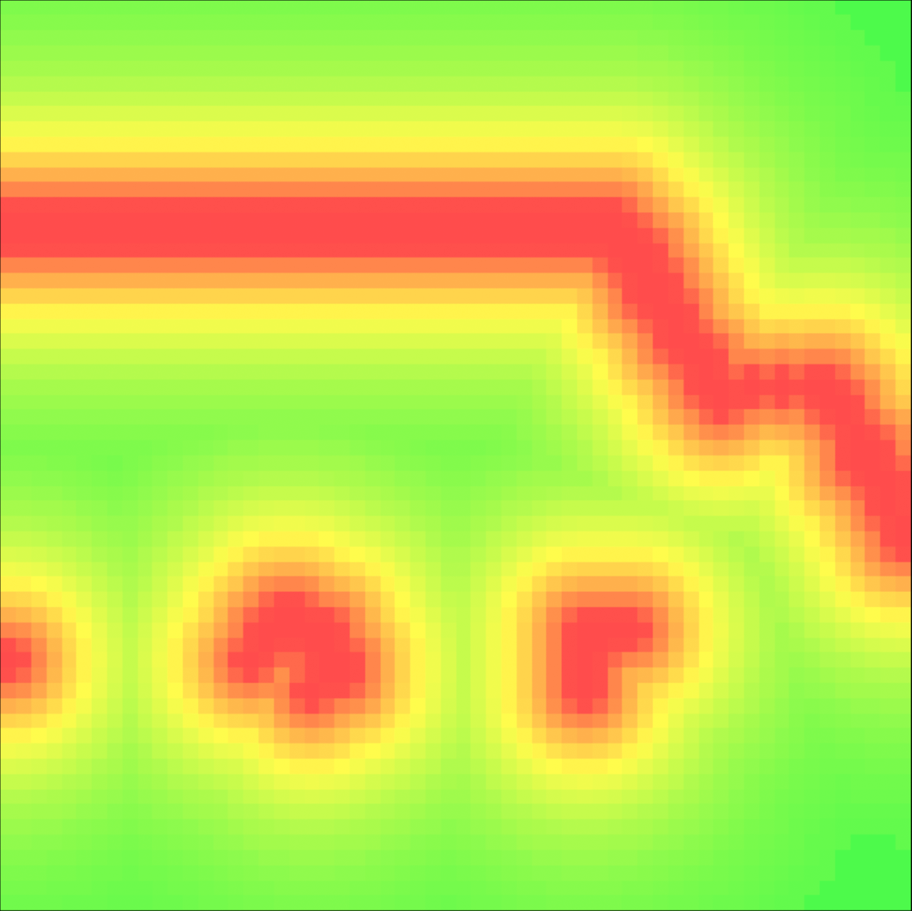

# Occupancy Map Visualization

Simple interactable visualization of for animating [rosbag](http://wiki.ros.org/rosbag) occupancy grid files built with [three.js](https://threejs.org/) and [websockets](https://developer.mozilla.org/en-US/docs/Web/API/WebSockets_API).



- ```read.js``` converts rosbag file to data.json
- ```server.py``` serves the data using websockets
- ```main.js``` visualizes the data using three.js
